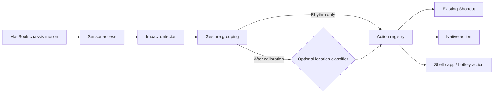
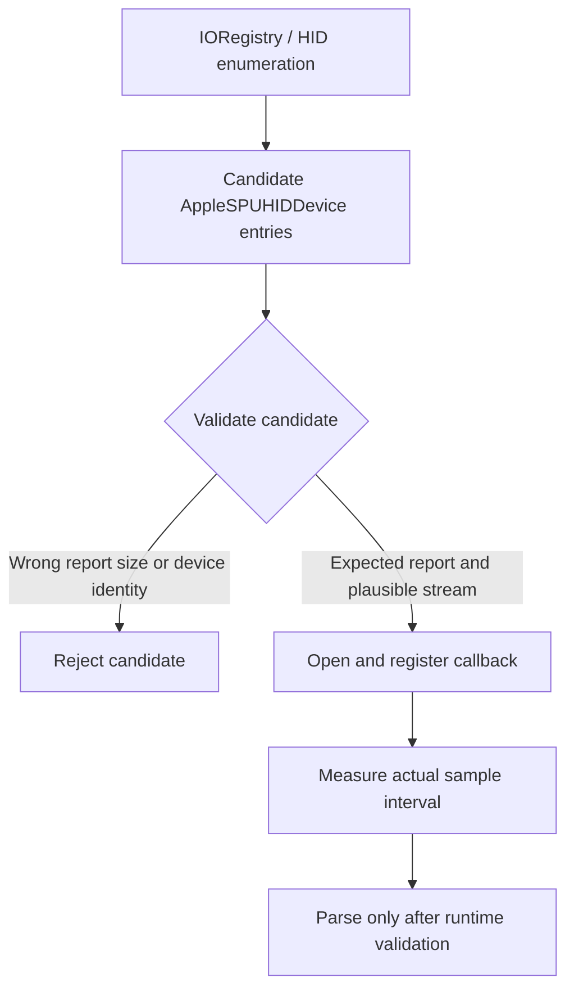
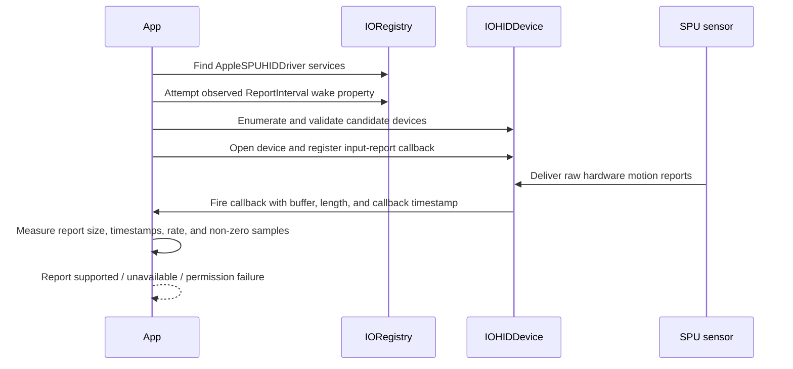
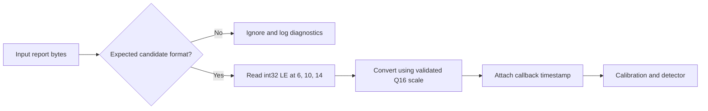
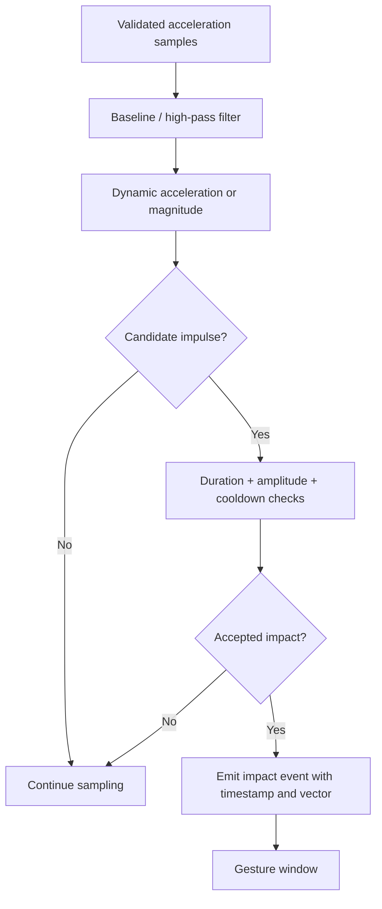
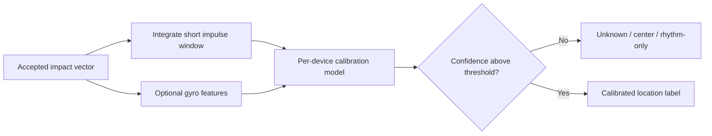
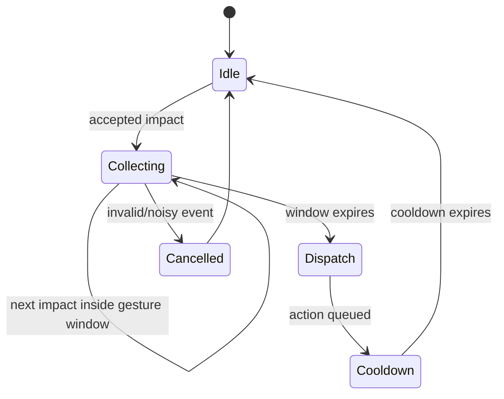
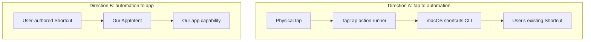
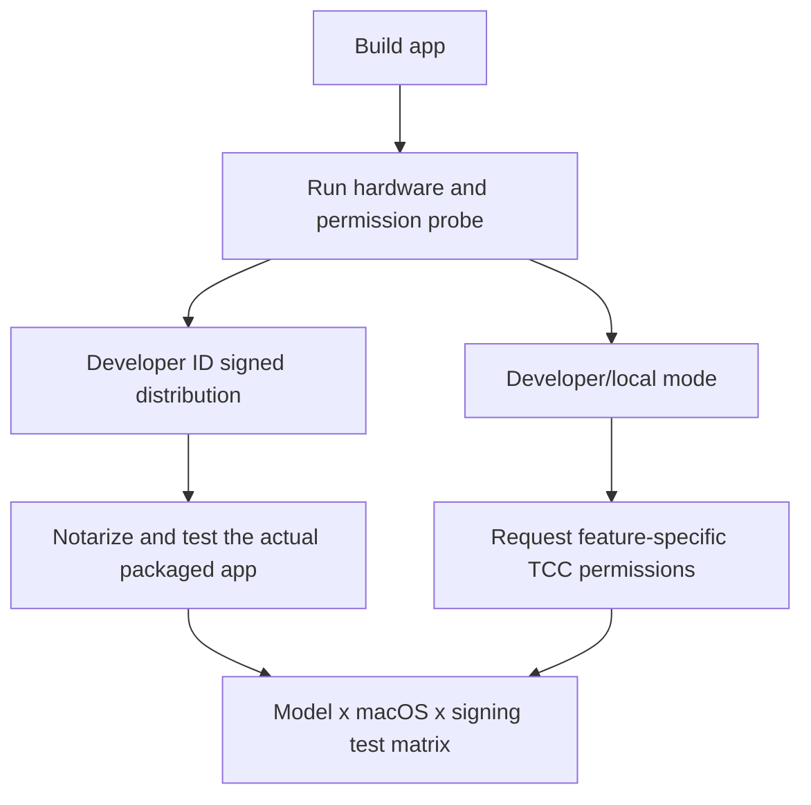

# Open-source MacBook tap gestures: verified research

> Research status: September 2026
>
> This document separates Apple-documented behavior from community reverse-engineering and from product ideas. It intentionally does **not** present unverified implementation details as facts.

## 1. What we are building

The practical open-source target is a native macOS menu-bar application that:

1. reads a motion stream when the Mac exposes a usable internal sensor;
2. detects intentional chassis impacts;
3. groups impacts into a configurable rhythm such as single, double, or triple;
4. optionally classifies the impact location, such as left/right/center, after calibration;
5. dispatches a local action, including an existing macOS Shortcut.

This is **not** the same as registering arbitrary new user shortcuts inside Apple’s Shortcuts library. Apple’s public APIs let an app expose its own `AppIntent`s and `AppShortcutsProvider` entries to Shortcuts, Siri, and Spotlight. They do not provide a documented API for another app to create arbitrary user-authored Shortcut workflows.



## 2. Sensor facts and uncertainty

### 2.1 What Apple documents

Apple documents the generic IOKit HID user-space APIs: device matching, opening devices, input-report callbacks, run-loop scheduling, and report access. Apple does **not** document `AppleSPUHIDDevice`, its vendor report format, its driver wake behavior, or a MacBook chassis-tap API.

Apple’s Core Motion documentation describes `CMMotionManager`, but Apple Developer Forum guidance and the open-source implementations below indicate that the MacBook internal SPU stream is not exposed through the normal native macOS Core Motion path. For a native macOS app, IOKit HID is the practical mechanism used by the community implementations; Core Motion is not a planned fallback for this sensor.

### 2.2 Community reverse-engineering findings

Several independent projects report an internal motion stream with these commonly observed properties:

| Item | Research conclusion |
|---|---|
| Registry device | Commonly identified as `AppleSPUHIDDevice` |
| Driver | Commonly associated with `AppleSPUHIDDriver` |
| Matching | Vendor usage page `0xFF00`, usage `3` is commonly used for the accelerometer; this must be validated against the actual device properties |
| Sensor identity | Bosch BMI286 is reported by multiple projects, but Apple’s public documentation does not confirm the component identity |
| Reports | A 22-byte format with signed little-endian values at offsets 6, 10, and 14 is widely reported; the format is undocumented and must be validated at runtime |
| Scale | `/ 65536` to obtain g-force is widely reported for that format; treat this as a parser assumption, not an Apple contract |
| Rate | Implementations report anything from roughly 100 Hz to roughly 800 Hz depending on driver state, report interval, decimation, and OS version |
| Coverage | Apple Silicon MacBooks differ. Base M1, desktops, and some models may not expose a usable stream. A hardware probe is mandatory |

The internal keyboard can also expose vendor-page devices. Matching only usage page and usage is insufficient in every environment; implementations report filtering by transport, report length, plausible values, or other device properties.



### 2.3 Wake and privilege claims

Some projects report that dormant SPU drivers begin producing reports after setting a `ReportInterval` property on matching `AppleSPUHIDDriver` services, often using the value `8000`. Other projects still require `sudo`. The defensible conclusion is:

- the wake sequence is a community-discovered workaround, not a public API;
- `8000` must be treated as an observed implementation value, not universally documented microseconds or a guaranteed 125 Hz setting;
- unprivileged operation has been reported on some macOS/model combinations, but cannot be promised for all users;
- the app must expose a diagnostic explaining whether enumeration, open, callback registration, and actual non-zero samples each succeeded.



## 3. Report parsing: only the narrow claim we can make

For the commonly reported 22-byte accelerometer format, community implementations decode three signed 32-bit little-endian values at byte offsets 6, 10, and 14. They divide by 65536 to obtain values expressed as g. We must not hard-code the report size or assume every vendor-page device uses this format. The callback supplies a runtime report length; setup should size any reusable buffer from the device’s maximum input-report-size property, then validate each callback’s actual length.



Required parser tests:

- reject short reports;
- use a sufficiently sized callback buffer from the device rather than blindly allocating 22 bytes;
- verify endianness and signedness with fixtures;
- distinguish accelerometer reports from the keyboard’s larger vendor reports;
- record timestamps and calculate the observed rate instead of assuming 100, 125, or 800 Hz.

## 4. Impact detection: established approaches, not one canonical algorithm

Open-source projects use different detectors. Reported approaches include:

- an EMA or high-pass baseline to remove gravity and slow drift;
- amplitude and/or jerk thresholds;
- minimum/maximum impulse duration;
- short cooldowns to reject chassis ringing;
- STA/LTA, CUSUM, kurtosis, and median/MAD detectors in experimental projects;
- adaptive calibration and a live waveform for tuning.

There is no evidence that Shortap uses a particular dual-EMA ratio, a particular alpha, or a particular timeout. Those values must be learned from our own recordings and tests.



A first version should store opt-in local sample traces and detector decisions. Without real data from supported Mac models, accuracy percentages and fixed thresholds would be fiction wearing a lab coat.

## 5. Location classification: do not overclaim left/right

An accelerometer measures motion at the sensor’s location; it does not directly report where a finger touched the chassis. Community projects demonstrate different scopes:

- some detect an impact anywhere on the chassis;
- some classify left/right/center from an integrated lateral impulse, often using the X-axis sign;
- some low-level experiments report a separate gyroscope usage, but the MVP does not depend on it;
- some require per-machine calibration because sensor placement, chassis, lid angle, desk, and tap location change the signal.

Therefore, left/right is an optional experimentally calibrated classifier, not a guaranteed physical coordinate system and not something we can claim is 98% accurate before collecting a representative dataset.



Calibration should record the user tapping labeled regions several times, store model parameters locally, and retain an `unknown` result. A rhythm-only mode is essential for machines where location separation is unreliable.

## 6. Multi-tap grouping

Single/double/triple grouping is a product-level state machine. It should use configurable values and expose them for testing; the research does not justify fixed `350 ms`, `450 ms`, `80 ms`, or `150 ms` constants.



The event should carry at least:

```text
timestamp, count, impacts[], optional location, confidence, detector diagnostics
```

## 7. Apple Shortcuts integration

### 7.1 Running a user’s existing Shortcut

Apple documents the macOS `shortcuts` command:

```sh
shortcuts list
shortcuts run "Shortcut Name"
shortcuts run "Shortcut Name" -i input.txt -o output.txt
```

The command returns status `0` on success and `1` on error. Apple also documents the URL scheme:

```text
shortcuts://run-shortcut?name=Encoded%20Name&input=text&text=Encoded%20input
```

For this project, the CLI is the better default because it supports process exit status, input paths, output paths, and does not require opening the Shortcuts UI. The URL scheme is a fallback for integrations where opening the URL is specifically desired.

The shortcut name must be resolved from the user’s local library. Names can be renamed or duplicated, so the UI should refresh the list and show execution errors rather than silently claiming success.

### 7.2 Exposing our own actions to Shortcuts

If the app has useful functionality of its own, Swift `AppIntent`s can expose those actions to Shortcuts and Spotlight. `AppShortcutsProvider` can provide preconfigured app shortcuts and Siri phrases; Apple documents a maximum of ten app shortcuts for that provider. This is separate from assigning a physical tap to an existing user Shortcut.



### 7.3 What we should not do

We should not generate or modify undocumented `.shortcut` binary plists, use private WorkflowKit runners, inject code into `/usr/bin/shortcuts`, or claim that an app can silently register arbitrary workflows. Those are reverse-engineering experiments, not a stable open-source product foundation.

## 8. Actions and permissions

The action registry should start small and use documented APIs where possible:

| Action | Safer implementation direction | Caveat |
|---|---|---|
| Run Shortcut | `/usr/bin/shortcuts run` via `Process` | User grants permissions required by the Shortcut’s actions |
| Open app or URL | `NSWorkspace` | App activation can be affected by Spaces and macOS policy |
| Keyboard shortcut | Quartz event posting | Accessibility permission and careful event semantics may be required |
| Window movement | Accessibility APIs | Accessibility permission; frontmost window may not be controllable |
| Screenshot | documented `screencapture` behavior or a Shortcut | Screen Recording/TCC can affect results |
| Wi-Fi/Bluetooth/Focus | Prefer user-created Shortcuts | Direct scripting/private APIs are OS-version-sensitive |
| Shell command | Explicit user-configured `Process` action | Must display a warning and never interpolate untrusted input |

“50+ built-in actions” is a feature claim made by Shortap’s marketing page, not a technical requirement or verified implementation detail. We can add actions incrementally after each one has an end-to-end test on supported macOS versions.

## 9. Permissions, packaging, and distribution

- Sensor access is undocumented and may behave differently for a terminal, ad-hoc-signed app, Developer ID app, sandboxed app, and helper process.
- Accessibility is needed for many global keyboard/window actions, not necessarily for merely reading the sensor.
- Input Monitoring, Screen Recording, Automation, and other TCC permissions should be requested only when a selected feature actually needs them.
- A sandboxed Mac App Store build must be treated as a separate feasibility question. Direct access to this private HID path and execution of arbitrary shell commands are not safe assumptions for App Store distribution.
- For direct distribution, Apple documents Developer ID signing, hardened runtime, notarization, and stapling. Notarization is not proof that the private sensor path will work on every model.



## 10. Recommended implementation plan

### Phase 0 — probe before UI

Build a tiny diagnostic executable that reports:

- architecture and macOS version;
- matching HID devices and properties;
- whether the wake attempt changed anything;
- open/callback status;
- report lengths, IDs, non-zero sample count, and measured rate;
- decoded vectors and a short local trace.

### Phase 1 — rhythm-only MVP

Implement one menu-bar app with:

- validated sensor reader;
- test mode and waveform;
- configurable threshold, gesture window, and cooldown;
- single/double/triple actions;
- run existing Shortcut by name;
- explicit unsupported-hardware and permission diagnostics.

### Phase 2 — calibration and location

Add left/right/center only after collecting traces across the supported model matrix. Keep rhythm-only mode as the default fallback.

### Phase 3 — action library and App Intents

Add documented native actions one at a time, then expose selected app capabilities through `AppIntent` and `AppShortcutsProvider`.

## 11. Evidence and source links

### Apple documentation

- [IOHIDDevice user-space API](https://developer.apple.com/documentation/iokit/iohiddevice_h_user-space)
- [IOHIDManager](https://developer.apple.com/documentation/iokit/iohidmanager_h)
- [HID Class Device Interface Guide](https://developer.apple.com/library/archive/documentation/DeviceDrivers/Conceptual/HID/overview/overview.html)
- [Run Shortcuts from the command line](https://support.apple.com/guide/shortcuts-mac/run-shortcuts-from-the-command-line-apd455c82f02/mac)
- [Run a Shortcut using a URL scheme](https://support.apple.com/guide/shortcuts-mac/run-a-shortcut-from-a-url-apd624386f42/mac)
- [AppShortcutsProvider](https://developer.apple.com/documentation/appintents/appshortcutsprovider)
- [Meet Shortcuts for macOS — WWDC21](https://developer.apple.com/videos/play/wwdc2021/10232/)
- [Implement App Shortcuts with App Intents — WWDC22](https://developer.apple.com/videos/play/wwdc2022/10170/)
- [Notarizing macOS software](https://developer.apple.com/documentation/security/notarizing-macos-software-before-distribution)

### Community implementations and experiments

These are useful engineering references, not Apple specifications:

- [olvvier/apple-silicon-accelerometer](https://github.com/olvvier/apple-silicon-accelerometer) — raw SPU HID exploration
- [Alex-duh/Bonk](https://github.com/Alex-duh/Bonk) — Swift menu-bar knock detector and wake-sequence notes
- [PostHog/meepslap](https://github.com/PostHog/meepslap) — direct IOKit reader and impact detector
- [AM-Guru/Slaptop](https://github.com/AM-Guru/Slaptop) — calibrated direction experiments
- [Gojaehyeon/knocker](https://github.com/Gojaehyeon/knocker) — side classification and privilege caveats
- [versacecrispies/Tapify](https://github.com/versacecrispies/Tapify) — Swift product implementation with sensitivity and waveform UI
- [shaircast/nocnoc](https://github.com/shaircast/nocnoc) — SwiftUI/MenuBarExtra architecture

## 12. Corrections to the earlier draft

The earlier document incorrectly stated or over-specified several points: universal rootless access, fixed 125 Hz operation, a guaranteed Bosch identity, a universal 22-byte layout, fixed DSP constants, guaranteed left/right physics and accuracy, an assumption that every built-in action has a particular Core Graphics implementation, required typing suppression, universal model support, and the ability to register arbitrary Shortcuts. Those claims have been removed or explicitly marked as conditional, community-reported, or future work.
